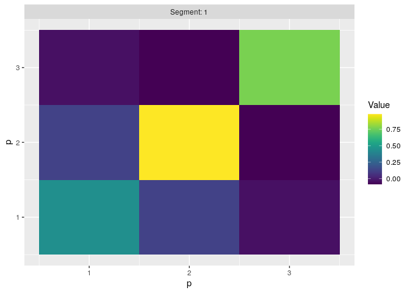

<!-- README.md is generated from README.Rmd. Please edit that file -->

# changepoint.cov

<!-- badges: start -->

[](https://github.com/grundy95/changepoint.cov/actions)
[](https://codecov.io/gh/grundy95/changepoint.cov)

<!-- badges: end -->

The goal of changepoint.cov is to provide methods for detecting
covariance or subspace changepoints in multivariate time series.

## Installation

<!-- You can install the released version of changepoint.cov from [CRAN](https://CRAN.R-project.org) with: -->
<!-- ``` r -->
<!-- install.packages("changepoint.cov") -->
<!-- ``` -->

You can install the development version from
[GitHub](https://github.com/) with:

``` r
# install.packages("devtools")
devtools::install_github("grundy95/changepoint.cov")
```

## Example

These basic examples show how to use the 2 main functions: `cptCov` for
detecting changes in covariance and `cptSubspace` for detecting changes
in subspace.

### `cptCov`

For detecting covariance changepoints in high-dimensional independent
time series, we recommend using `method='Ratio'`.

``` r
library(changepoint.cov)
## basic example code
set.seed(1)
data <- wishartDataGeneration(n=200,p=50,tau=100)$data

ansRatio <- cptCov(X=data, method='Ratio')
summary(ansRatio)
#> Created using changepoint.cov version 0.5.0 
#> Method               :  Ratio 
#> Multiple changepoint method :  AMOC 
#> Minimum segment length      :  100 
#> Changepoints         :  100
covEst(ansRatio)
#> [[1]]
#>               PC1          PC2          PC3          PC4          PC5
#> PC1   0.840294767  0.127803065 -0.192783379  0.049212918 -0.172715697
#> PC2   0.127803065  1.033214140  0.001863860 -0.012850548 -0.327296499
#> PC3  -0.192783379  0.001863860  0.760743643  0.099320110 -0.008524936
#> PC4   0.049212918 -0.012850548  0.099320110  0.582874476  0.011266576
#> PC5  -0.172715697 -0.327296499 -0.008524936  0.011266576  0.802696868
#> PC6  -0.007923601 -0.106815165  0.061532239 -0.024801162 -0.077304092
#> PC7  -0.020302883  0.127323015  0.136026074  0.025495762 -0.149568285
#> PC8  -0.093615294  0.079811868  0.010019062 -0.035986352 -0.017720854
#> PC9   0.088110819  0.145183936 -0.078029748 -0.067205982  0.073569867
#> PC10 -0.164258461  0.122224464  0.160263190 -0.083423561 -0.063654336
#> PC11 -0.018893209 -0.054236353  0.245872802  0.009282079  0.069497927
#> PC12 -0.008592756 -0.072535745 -0.110434176 -0.075872897  0.204599001
#> PC13 -0.015914811 -0.098839369  0.017296709 -0.052208873  0.287262169
#> PC14  0.168666521  0.048060301  0.133738786 -0.045402733  0.032573925
#> PC15  0.161338639 -0.054019543 -0.016466942  0.227063253 -0.025843083
#> PC16  0.143737158  0.249614241 -0.039145831 -0.134336358 -0.365206637
#> PC17 -0.086501066  0.011894197 -0.094884147 -0.101954520 -0.078002257
#> PC18 -0.226210474 -0.108014730  0.068196234  0.048631771  0.298560421
#> PC19 -0.127293825 -0.110232657  0.025275737 -0.095998605 -0.026938744
#> PC20  0.244451785 -0.167763308  0.017464539  0.018585910 -0.085414569
#> PC21  0.204318901 -0.086338207  0.183381293  0.057364925 -0.258898426
#> PC22  0.300037320 -0.014161993 -0.145386561  0.295919565 -0.011812957
#> PC23 -0.118619242 -0.072778056 -0.007059148 -0.012120497 -0.006266525
#> PC24  0.024617989  0.031974977  0.045489262  0.141872240  0.249097507
#> PC25  0.197364436  0.084476629  0.071445689 -0.058184301 -0.115423669
#> PC26 -0.119250064 -0.171595278  0.042259230  0.116236775  0.005655751
#> PC27 -0.202598102 -0.110361079 -0.111480661 -0.097698190 -0.184807443
#> PC28  0.129832110  0.064847762  0.020789516  0.199042812 -0.084409878
#> PC29  0.135066137 -0.175135785 -0.089918132  0.161818765  0.158427634
#> PC30  0.349823834  0.070611589  0.058889487  0.083785643 -0.205814833
#> PC31 -0.010672659  0.057817861  0.032497805  0.032272656 -0.090478389
#> PC32 -0.122571428  0.152313005  0.108634460 -0.012844172  0.192254650
#> PC33 -0.291711140 -0.031133100  0.289369944  0.032874964  0.120479092
#> PC34  0.081626668 -0.062098808 -0.058971441 -0.150510244  0.099851487
#> PC35  0.130768606  0.139460150  0.118616394 -0.007546828 -0.392844316
#> PC36  0.100806831  0.346207469  0.072665732 -0.008027519 -0.186441765
#> PC37  0.195521035 -0.152106428 -0.294199901 -0.130999227 -0.041286113
#> PC38  0.140346932  0.007615583 -0.145446889 -0.134629727 -0.175659715
#> PC39  0.002185777 -0.259907774 -0.173032094 -0.204550073  0.206727691
#> PC40 -0.194962639  0.178047282  0.070657553  0.116758303 -0.087586895
#> PC41  0.010159082  0.010448003  0.027621618 -0.007101251 -0.052193863
#> PC42 -0.326423155  0.236118394  0.088979920 -0.188077312  0.030621385
#> PC43 -0.038053669 -0.024839225  0.047421996  0.149384889  0.100821777
#> PC44  0.155944677  0.074545909 -0.287456983 -0.369032494  0.030714362
#> PC45 -0.326692804 -0.093372823  0.312867893 -0.035612137  0.065519917
#> PC46 -0.062883475  0.033927970 -0.008162327 -0.209596577 -0.169906182
#> PC47 -0.003132630  0.151071680 -0.138316344  0.162972633 -0.191485562
#> PC48 -0.043545749  0.276444613 -0.113818660  0.152741528  0.104810245
#> PC49  0.021802538  0.007427964 -0.253343406 -0.044102532  0.220107266
#> PC50  0.099145002  0.043543750 -0.109629277 -0.089859018 -0.053499563
#>               PC6          PC7          PC8          PC9         PC10
#> PC1  -0.007923601 -0.020302883 -0.093615294  0.088110819 -0.164258461
#> PC2  -0.106815165  0.127323015  0.079811868  0.145183936  0.122224464
#> PC3   0.061532239  0.136026074  0.010019062 -0.078029748  0.160263190
#> PC4  -0.024801162  0.025495762 -0.035986352 -0.067205982 -0.083423561
#> PC5  -0.077304092 -0.149568285 -0.017720854  0.073569867 -0.063654336
#> PC6   0.866908306 -0.061661894 -0.113547626 -0.054591169 -0.287649134
#> PC7  -0.061661894  0.796570474  0.062791793 -0.189821521  0.381255099
#> PC8  -0.113547626  0.062791793  0.758748141  0.052874123  0.197604635
#> PC9  -0.054591169 -0.189821521  0.052874123  0.877031282 -0.121645449
#> PC10 -0.287649134  0.381255099  0.197604635 -0.121645449  1.134987597
#> PC11 -0.074649920  0.036085620 -0.175052725  0.069000203  0.056133661
#> PC12  0.202335744 -0.066772813  0.013453409  0.046128286 -0.326685952
#> PC13  0.046179194 -0.023856251 -0.023372696  0.165108763 -0.378289681
#> PC14  0.214849374 -0.128048212 -0.226326339  0.212277981 -0.324748773
#> PC15 -0.090610123 -0.112044850 -0.061809392 -0.181167016  0.062022642
#> PC16  0.054102445 -0.016589854  0.163104702 -0.150846122  0.068871900
#> PC17 -0.046563505  0.052988043  0.056240659 -0.080321846  0.180874996
#> PC18  0.017312199 -0.080382938  0.096108497 -0.165517972  0.122515444
#> PC19  0.128884116 -0.165592006  0.059696603  0.288541297  0.007423198
#> PC20 -0.200347142 -0.201984612  0.074418232  0.240365758 -0.053726343
#> PC21  0.374052603  0.021234403 -0.112583232 -0.013452956  0.229148394
#> PC22 -0.196173051  0.092512183  0.146287063 -0.247345225 -0.073447302
#> PC23  0.209831373 -0.006692034  0.338564492 -0.181641250 -0.113113845
#> PC24 -0.148113324 -0.255255390 -0.043643746  0.006827341  0.147843183
#> PC25 -0.050278838 -0.007605011 -0.023924024 -0.139289468 -0.083759054
#> PC26  0.211930914  0.004693382 -0.044256621 -0.067170768 -0.341553235
#> PC27  0.121527657 -0.059637662 -0.106889971 -0.170667054 -0.148692674
#> PC28  0.045031914  0.369788601 -0.073787785 -0.159237734  0.008965908
#> PC29 -0.144741764 -0.096146718  0.218131650 -0.031963920 -0.222299876
#> PC30 -0.178535069 -0.145524420  0.017911175 -0.151656568 -0.290120647
#> PC31  0.067740893  0.069286152  0.077503739  0.004651519  0.247273983
#> PC32  0.098208857 -0.082265727 -0.006211783  0.153603697  0.126729827
#> PC33 -0.128088377  0.084159748 -0.014088144 -0.136816202  0.329432541
#> PC34 -0.027950323 -0.138305787 -0.197935412  0.124937734  0.011229953
#> PC35  0.259228990 -0.024918529 -0.141845756 -0.034235769 -0.078874333
#> PC36 -0.136028299  0.199876842  0.136070071  0.013051649  0.241230043
#> PC37 -0.190300785  0.170415471 -0.151526718 -0.106677002  0.155422641
#> PC38  0.033938829  0.097711461 -0.218374875  0.035952123  0.139301065
#> PC39 -0.296845406 -0.192930277  0.152641154  0.135289593  0.181217716
#> PC40 -0.106181438  0.060565283  0.162912843 -0.138795944 -0.123327304
#> PC41 -0.022993031  0.010884139  0.250291743 -0.172201820  0.161090796
#> PC42 -0.044053772  0.247047448 -0.025106203 -0.350648406  0.064770712
#> PC43  0.052117076  0.008842864  0.102318992 -0.277155124  0.020686220
#> PC44 -0.233453030  0.338156545  0.183782131  0.031502115  0.336427129
#> PC45  0.006950338  0.132190577 -0.079045946  0.020231316  0.157861106
#> PC46  0.150755803  0.057908133  0.047947342 -0.220507213  0.211510923
#> PC47 -0.243028843  0.207855056  0.194712583 -0.079086372  0.248665990
#> PC48 -0.426458040  0.082517782 -0.032103456 -0.119185441  0.247263945
#> PC49 -0.134881889  0.011534447  0.124257697  0.145096662 -0.162986850
#> PC50 -0.153802840  0.055685025  0.132687008 -0.296844997  0.084218633
#>              PC11         PC12        PC13         PC14          PC15
#> PC1  -0.018893209 -0.008592756 -0.01591481  0.168666521  0.1613386395
#> PC2  -0.054236353 -0.072535745 -0.09883937  0.048060301 -0.0540195426
#> PC3   0.245872802 -0.110434176  0.01729671  0.133738786 -0.0164669416
#> PC4   0.009282079 -0.075872897 -0.05220887 -0.045402733  0.2270632531
#> PC5   0.069497927  0.204599001  0.28726217  0.032573925 -0.0258430830
#> PC6  -0.074649920  0.202335744  0.04617919  0.214849374 -0.0906101233
#> PC7   0.036085620 -0.066772813 -0.02385625 -0.128048212 -0.1120448503
#> PC8  -0.175052725  0.013453409 -0.02337270 -0.226326339 -0.0618093916
#> PC9   0.069000203  0.046128286  0.16510876  0.212277981 -0.1811670155
#> PC10  0.056133661 -0.326685952 -0.37828968 -0.324748773  0.0620226418
#> PC11  0.805765707 -0.151448806 -0.07931555  0.121416497 -0.0954320213
#> PC12 -0.151448806  0.911134099  0.19202415 -0.074206539 -0.1042461951
#> PC13 -0.079315548  0.192024146  1.19932618  0.274406800  0.1004011713
#> PC14  0.121416497 -0.074206539  0.27440680  0.937632231 -0.0833624828
#> PC15 -0.095432021 -0.104246195  0.10040117 -0.083362483  0.7530950745
#> PC16 -0.285154233 -0.090625156 -0.20826447 -0.153292139 -0.0139365906
#> PC17 -0.135843121 -0.034673169  0.21322039 -0.140130620 -0.0313136929
#> PC18 -0.091975819 -0.045083290  0.22354283 -0.099786432  0.0984431989
#> PC19  0.130684752 -0.090868447 -0.07511363  0.074406373 -0.0986126964
#> PC20  0.134607477 -0.079646704  0.10057183  0.114658459  0.0556245103
#> PC21  0.041880189 -0.182145046 -0.33997770  0.031262095  0.2920977954
#> PC22  0.142278209 -0.069020460 -0.05557041 -0.166033603  0.0367111209
#> PC23 -0.402251768 -0.069632212  0.05050176  0.191116169 -0.0817760628
#> PC24  0.308052435 -0.405240824 -0.01895387  0.090280861  0.1894486410
#> PC25  0.045271510 -0.102778194  0.01686939 -0.093984461  0.0753093074
#> PC26  0.094326278 -0.045696627  0.17264070  0.107463350 -0.2754602400
#> PC27  0.006694843 -0.021435831 -0.19895800 -0.022868044 -0.1662854743
#> PC28 -0.050193237 -0.251296551 -0.22594910  0.003274441  0.0228962292
#> PC29 -0.208488376  0.164597315  0.17841815 -0.180973621  0.2474088088
#> PC30  0.238867169 -0.162866692 -0.38958733  0.023630725 -0.0289670416
#> PC31 -0.082427796 -0.164794223 -0.18846503  0.139729378  0.1842393583
#> PC32  0.149102751 -0.116353344  0.15497356  0.086908460  0.0815923672
#> PC33  0.038020269 -0.168567976 -0.07492415 -0.229633523  0.0059584253
#> PC34  0.055282299 -0.068682525 -0.16075505  0.053710288 -0.1114133603
#> PC35  0.006479656 -0.052243619 -0.03146352  0.091211546 -0.0635363553
#> PC36 -0.017452150 -0.108244771 -0.30552776 -0.196924731  0.1381303793
#> PC37 -0.169951793 -0.097654829 -0.09436234 -0.001393565  0.1540709203
#> PC38 -0.012275259  0.073189028 -0.08922795 -0.218898558  0.0120407165
#> PC39 -0.088012244  0.138056919 -0.03475231 -0.354859683 -0.0391857490
#> PC40 -0.161773070 -0.192048833 -0.16647356  0.154924282 -0.1477096364
#> PC41  0.164143743 -0.247079297  0.02862205  0.092213408  0.0644702174
#> PC42  0.051542107 -0.058136584  0.20596308  0.029658009 -0.0137033854
#> PC43  0.146377389 -0.090656183 -0.04702053 -0.159316232 -0.0008011186
#> PC44 -0.003454592  0.002005457 -0.04033605  0.023747534 -0.3791500422
#> PC45 -0.010250018  0.003761915  0.11110008 -0.115510758 -0.0289667979
#> PC46 -0.165717041 -0.033273297 -0.08685986 -0.008254124 -0.1335577082
#> PC47 -0.243601729  0.041309908 -0.05792463 -0.325592008  0.0597246641
#> PC48 -0.008368751 -0.175831039 -0.09848486 -0.088837050  0.1922157431
#> PC49 -0.167692718  0.154595938  0.11530362  0.084321653 -0.1174555008
#> PC50 -0.076861406  0.069002404 -0.07359744 -0.173725048  0.1836373850
#>              PC16         PC17         PC18         PC19        PC20
#> PC1   0.143737158 -0.086501066 -0.226210474 -0.127293825  0.24445179
#> PC2   0.249614241  0.011894197 -0.108014730 -0.110232657 -0.16776331
#> PC3  -0.039145831 -0.094884147  0.068196234  0.025275737  0.01746454
#> PC4  -0.134336358 -0.101954520  0.048631771 -0.095998605  0.01858591
#> PC5  -0.365206637 -0.078002257  0.298560421 -0.026938744 -0.08541457
#> PC6   0.054102445 -0.046563505  0.017312199  0.128884116 -0.20034714
#> PC7  -0.016589854  0.052988043 -0.080382938 -0.165592006 -0.20198461
#> PC8   0.163104702  0.056240659  0.096108497  0.059696603  0.07441823
#> PC9  -0.150846122 -0.080321846 -0.165517972  0.288541297  0.24036576
#> PC10  0.068871900  0.180874996  0.122515444  0.007423198 -0.05372634
#> PC11 -0.285154233 -0.135843121 -0.091975819  0.130684752  0.13460748
#> PC12 -0.090625156 -0.034673169 -0.045083290 -0.090868447 -0.07964670
#> PC13 -0.208264471  0.213220393  0.223542833 -0.075113633  0.10057183
#> PC14 -0.153292139 -0.140130620 -0.099786432  0.074406373  0.11465846
#> PC15 -0.013936591 -0.031313693  0.098443199 -0.098612696  0.05562451
#> PC16  0.951633956 -0.132076655  0.001627919 -0.086300574  0.01337399
#> PC17 -0.132076655  0.923253921 -0.025966047  0.137291545  0.06212398
#> PC18  0.001627919 -0.025966047  0.899402397 -0.202519957 -0.37439948
#> PC19 -0.086300574  0.137291545 -0.202519957  0.951983300  0.10732791
#> PC20  0.013373987  0.062123978 -0.374399480  0.107327912  1.13497255
#> PC21 -0.047868820 -0.079409949 -0.044338428  0.353267525 -0.21265074
#> PC22  0.117009768 -0.076946743  0.212015738 -0.065773507 -0.04988955
#> PC23 -0.025199723  0.166333621 -0.026568934 -0.031438276  0.22685048
#> PC24 -0.091280606  0.005070824  0.126453521  0.023718223  0.09017702
#> PC25  0.133955567  0.257683797  0.031464859 -0.227098879  0.16874524
#> PC26 -0.250467885  0.172352633 -0.125333562  0.246443294  0.22945781
#> PC27  0.215664034 -0.155298988 -0.020405628 -0.190724724 -0.12803395
#> PC28 -0.007674237 -0.125553626 -0.342348794 -0.008493201  0.01224175
#> PC29  0.167425722 -0.289277497  0.145198167 -0.254103643  0.10408116
#> PC30  0.217992921 -0.405026810 -0.218175445  0.009918314  0.39676976
#> PC31  0.033750963 -0.081387891 -0.122692785  0.171168659 -0.14507126
#> PC32 -0.325889767  0.103738174 -0.006020694  0.049239656  0.06865740
#> PC33 -0.014880699  0.131886821 -0.010100400 -0.042525083  0.20964347
#> PC34  0.033997913 -0.217528437  0.017340344  0.060335542 -0.17364996
#> PC35  0.359869966 -0.045597219  0.082559352  0.063406833 -0.15724486
#> PC36  0.180995574 -0.071189626 -0.117174982 -0.006495236 -0.05551341
#> PC37 -0.003246617  0.177931184 -0.024526654 -0.274056195 -0.19493365
#> PC38 -0.088135306  0.267002768 -0.192718082  0.063471372 -0.09749346
#> PC39 -0.010697106  0.326705789  0.095613962  0.294695080  0.13603823
#> PC40 -0.030171649 -0.110842831  0.029849878 -0.025804840  0.05776988
#> PC41  0.176682836  0.116981830  0.119813398 -0.037603626 -0.06125545
#> PC42 -0.065799871  0.074042074  0.164086201 -0.266403692 -0.34087757
#> PC43  0.080165430 -0.002184119  0.388573082 -0.099505231 -0.40140216
#> PC44 -0.261837334  0.363198575 -0.285598356 -0.147621914  0.26512841
#> PC45 -0.097003168 -0.054314526 -0.026117733  0.183423777 -0.28368530
#> PC46  0.275373074  0.239946737 -0.185590634 -0.143061119  0.11680495
#> PC47 -0.018617209  0.250544592  0.101705179 -0.099954834 -0.23341023
#> PC48 -0.004186432 -0.111876848  0.060979921 -0.111986388 -0.16571477
#> PC49 -0.086034519 -0.201234322  0.027736177 -0.052918746  0.01059528
#> PC50  0.300958515 -0.102164596 -0.097959288 -0.148145074  0.05792747
#>              PC21          PC22         PC23         PC24         PC25
#> PC1   0.204318901  0.3000373205 -0.118619242  0.024617989  0.197364436
#> PC2  -0.086338207 -0.0141619931 -0.072778056  0.031974977  0.084476629
#> PC3   0.183381293 -0.1453865610 -0.007059148  0.045489262  0.071445689
#> PC4   0.057364925  0.2959195650 -0.012120497  0.141872240 -0.058184301
#> PC5  -0.258898426 -0.0118129572 -0.006266525  0.249097507 -0.115423669
#> PC6   0.374052603 -0.1961730506  0.209831373 -0.148113324 -0.050278838
#> PC7   0.021234403  0.0925121829 -0.006692034 -0.255255390 -0.007605011
#> PC8  -0.112583232  0.1462870634  0.338564492 -0.043643746 -0.023924024
#> PC9  -0.013452956 -0.2473452250 -0.181641250  0.006827341 -0.139289468
#> PC10  0.229148394 -0.0734473020 -0.113113845  0.147843183 -0.083759054
#> PC11  0.041880189  0.1422782094 -0.402251768  0.308052435  0.045271510
#> PC12 -0.182145046 -0.0690204596 -0.069632212 -0.405240824 -0.102778194
#> PC13 -0.339977696 -0.0555704077  0.050501759 -0.018953875  0.016869394
#> PC14  0.031262095 -0.1660336029  0.191116169  0.090280861 -0.093984461
#> PC15  0.292097795  0.0367111209 -0.081776063  0.189448641  0.075309307
#> PC16 -0.047868820  0.1170097677 -0.025199723 -0.091280606  0.133955567
#> PC17 -0.079409949 -0.0769467425  0.166333621  0.005070824  0.257683797
#> PC18 -0.044338428  0.2120157384 -0.026568934  0.126453521  0.031464859
#> PC19  0.353267525 -0.0657735072 -0.031438276  0.023718223 -0.227098879
#> PC20 -0.212650744 -0.0498895471  0.226850478  0.090177016  0.168745243
#> PC21  1.413830605 -0.0556253157 -0.093787387  0.142374826 -0.066380599
#> PC22 -0.055625316  1.2439990662 -0.319910443  0.270916999  0.057324280
#> PC23 -0.093787387 -0.3199104434  1.291103437  0.030616315 -0.006240213
#> PC24  0.142374826  0.2709169992  0.030616315  1.278594742 -0.008211043
#> PC25 -0.066380599  0.0573242801 -0.006240213 -0.008211043  0.753986292
#> PC26  0.030177903  0.0315737524  0.407037191 -0.080746324  0.030433371
#> PC27 -0.149344702  0.0387568970 -0.031150562  0.034627708 -0.019207859
#> PC28  0.174691344 -0.0464648148  0.133051250  0.119902839 -0.081064216
#> PC29 -0.259504727  0.1114550733  0.092770961 -0.153411850  0.175414920
#> PC30  0.262579977  0.2892542091  0.173147674  0.164960700  0.120504093
#> PC31  0.564653843 -0.1281984420  0.051732351  0.443939227 -0.261644054
#> PC32  0.073807930 -0.3502203107  0.231437962  0.262598987  0.139668616
#> PC33 -0.219156688 -0.3952762660  0.158946641  0.014305340  0.076586708
#> PC34  0.197112226 -0.1843633239 -0.220946298  0.065056098 -0.161464393
#> PC35  0.405522109  0.0760921581 -0.144608152 -0.212456612  0.174134295
#> PC36  0.235954110 -0.1017637709 -0.037672334 -0.190424196  0.106381063
#> PC37 -0.032296723 -0.0173015721 -0.245728192 -0.089467773  0.107730322
#> PC38  0.297469482 -0.2357664488 -0.301632994 -0.218883605  0.076897214
#> PC39 -0.159844561 -0.0008489378 -0.274782256 -0.038761457  0.205046832
#> PC40 -0.263952901  0.1662121172  0.402335543 -0.205383388 -0.008414359
#> PC41  0.031716290  0.0388576561  0.269614056  0.166791295  0.051078310
#> PC42 -0.310642664 -0.2335453525  0.170231630 -0.222454060 -0.031119824
#> PC43 -0.001434997  0.2711301031 -0.050881223  0.246716497  0.063374423
#> PC44 -0.343103648 -0.1125718729  0.129901117 -0.246814654  0.204630652
#> PC45  0.154557194 -0.2880191983 -0.256725852 -0.237049768 -0.264028608
#> PC46 -0.273801716 -0.2647192544  0.398170369 -0.056192673  0.049335941
#> PC47 -0.085595149  0.2003637564 -0.140194650 -0.327061395 -0.081746877
#> PC48 -0.245155630  0.0293431318 -0.009345424  0.168224562 -0.056511746
#> PC49 -0.451859208  0.1922763588  0.122316713 -0.146200018 -0.134624088
#> PC50 -0.261346704  0.0495122231  0.052695078  0.031230801 -0.050136538
#>              PC26         PC27         PC28        PC29         PC30
#> PC1  -0.119250064 -0.202598102  0.129832110  0.13506614  0.349823834
#> PC2  -0.171595278 -0.110361079  0.064847762 -0.17513578  0.070611589
#> PC3   0.042259230 -0.111480661  0.020789516 -0.08991813  0.058889487
#> PC4   0.116236775 -0.097698190  0.199042812  0.16181877  0.083785643
#> PC5   0.005655751 -0.184807443 -0.084409878  0.15842763 -0.205814833
#> PC6   0.211930914  0.121527657  0.045031914 -0.14474176 -0.178535069
#> PC7   0.004693382 -0.059637662  0.369788601 -0.09614672 -0.145524420
#> PC8  -0.044256621 -0.106889971 -0.073787785  0.21813165  0.017911175
#> PC9  -0.067170768 -0.170667054 -0.159237734 -0.03196392 -0.151656568
#> PC10 -0.341553235 -0.148692674  0.008965908 -0.22229988 -0.290120647
#> PC11  0.094326278  0.006694843 -0.050193237 -0.20848838  0.238867169
#> PC12 -0.045696627 -0.021435831 -0.251296551  0.16459731 -0.162866692
#> PC13  0.172640697 -0.198958004 -0.225949098  0.17841815 -0.389587328
#> PC14  0.107463350 -0.022868044  0.003274441 -0.18097362  0.023630725
#> PC15 -0.275460240 -0.166285474  0.022896229  0.24740881 -0.028967042
#> PC16 -0.250467885  0.215664034 -0.007674237  0.16742572  0.217992921
#> PC17  0.172352633 -0.155298988 -0.125553626 -0.28927750 -0.405026810
#> PC18 -0.125333562 -0.020405628 -0.342348794  0.14519817 -0.218175445
#> PC19  0.246443294 -0.190724724 -0.008493201 -0.25410364  0.009918314
#> PC20  0.229457810 -0.128033954  0.012241748  0.10408116  0.396769763
#> PC21  0.030177903 -0.149344702  0.174691344 -0.25950473  0.262579977
#> PC22  0.031573752  0.038756897 -0.046464815  0.11145507  0.289254209
#> PC23  0.407037191 -0.031150562  0.133051250  0.09277096  0.173147674
#> PC24 -0.080746324  0.034627708  0.119902839 -0.15341185  0.164960700
#> PC25  0.030433371 -0.019207859 -0.081064216  0.17541492  0.120504093
#> PC26  1.099578736  0.084382786  0.235171293 -0.26972825  0.247768657
#> PC27  0.084382786  0.992622095  0.056481301 -0.34369280 -0.084250509
#> PC28  0.235171293  0.056481301  1.019415071 -0.15859748  0.165529117
#> PC29 -0.269728248 -0.343692797 -0.158597477  1.12728948  0.248008149
#> PC30  0.247768657 -0.084250509  0.165529117  0.24800815  1.599673480
#> PC31 -0.073348709 -0.118406987  0.341428618 -0.21428611  0.051783991
#> PC32  0.042767416 -0.210228337 -0.149783208  0.10828183 -0.159285034
#> PC33  0.020328699 -0.116978945  0.162085039 -0.05280558 -0.114781989
#> PC34 -0.119264102 -0.147961570  0.056089257 -0.02651182  0.275420640
#> PC35 -0.076837192  0.041486914 -0.311576941  0.07187794  0.216848415
#> PC36 -0.114701648 -0.222940145  0.159804685  0.15954977  0.290477281
#> PC37 -0.431160277  0.055809957  0.229903290 -0.01536487 -0.293391811
#> PC38  0.008893244  0.034976027  0.168793128 -0.24503487 -0.289968664
#> PC39 -0.099339591 -0.285324801 -0.157346609  0.16679951 -0.130541066
#> PC40  0.365559639  0.237051841  0.151490365 -0.20705369  0.139470011
#> PC41  0.068758571 -0.014841873 -0.157180270 -0.01757385  0.227268424
#> PC42  0.149787281  0.183834500  0.060137382 -0.23543157 -0.287386429
#> PC43  0.001785193 -0.067109799 -0.077435696  0.19884792  0.075073473
#> PC44  0.046772051 -0.167321307  0.196209483 -0.06067765 -0.104675893
#> PC45 -0.057588949  0.035190610  0.053361473 -0.21868140 -0.342802787
#> PC46  0.147588133  0.242340171 -0.023080957 -0.20857602 -0.228988647
#> PC47 -0.012799536 -0.115469194 -0.089566692  0.06100647 -0.311625033
#> PC48 -0.211427270 -0.165689224  0.096819742  0.21381228 -0.048684736
#> PC49 -0.038256669  0.065314523 -0.040969185  0.14059562 -0.070589463
#> PC50 -0.007820462  0.205714539  0.118647478  0.06279317  0.164518897
#>              PC31         PC32         PC33         PC34          PC35
#> PC1  -0.010672659 -0.122571428 -0.291711140  0.081626668  0.1307686058
#> PC2   0.057817861  0.152313005 -0.031133100 -0.062098808  0.1394601498
#> PC3   0.032497805  0.108634460  0.289369944 -0.058971441  0.1186163941
#> PC4   0.032272656 -0.012844172  0.032874964 -0.150510244 -0.0075468280
#> PC5  -0.090478389  0.192254650  0.120479092  0.099851487 -0.3928443162
#> PC6   0.067740893  0.098208857 -0.128088377 -0.027950323  0.2592289897
#> PC7   0.069286152 -0.082265727  0.084159748 -0.138305787 -0.0249185289
#> PC8   0.077503739 -0.006211783 -0.014088144 -0.197935412 -0.1418457559
#> PC9   0.004651519  0.153603697 -0.136816202  0.124937734 -0.0342357685
#> PC10  0.247273983  0.126729827  0.329432541  0.011229953 -0.0788743332
#> PC11 -0.082427796  0.149102751  0.038020269  0.055282299  0.0064796562
#> PC12 -0.164794223 -0.116353344 -0.168567976 -0.068682525 -0.0522436187
#> PC13 -0.188465025  0.154973558 -0.074924149 -0.160755045 -0.0314635233
#> PC14  0.139729378  0.086908460 -0.229633523  0.053710288  0.0912115462
#> PC15  0.184239358  0.081592367  0.005958425 -0.111413360 -0.0635363553
#> PC16  0.033750963 -0.325889767 -0.014880699  0.033997913  0.3598699658
#> PC17 -0.081387891  0.103738174  0.131886821 -0.217528437 -0.0455972195
#> PC18 -0.122692785 -0.006020694 -0.010100400  0.017340344  0.0825593518
#> PC19  0.171168659  0.049239656 -0.042525083  0.060335542  0.0634068334
#> PC20 -0.145071262  0.068657397  0.209643468 -0.173649961 -0.1572448631
#> PC21  0.564653843  0.073807930 -0.219156688  0.197112226  0.4055221088
#> PC22 -0.128198442 -0.350220311 -0.395276266 -0.184363324  0.0760921581
#> PC23  0.051732351  0.231437962  0.158946641 -0.220946298 -0.1446081518
#> PC24  0.443939227  0.262598987  0.014305340  0.065056098 -0.2124566117
#> PC25 -0.261644054  0.139668616  0.076586708 -0.161464393  0.1741342951
#> PC26 -0.073348709  0.042767416  0.020328699 -0.119264102 -0.0768371915
#> PC27 -0.118406987 -0.210228337 -0.116978945 -0.147961570  0.0414869136
#> PC28  0.341428618 -0.149783208  0.162085039  0.056089257 -0.3115769411
#> PC29 -0.214286114  0.108281831 -0.052805583 -0.026511823  0.0718779432
#> PC30  0.051783991 -0.159285034 -0.114781989  0.275420640  0.2168484150
#> PC31  0.952036001  0.051296565 -0.002871703  0.235868041 -0.1163440036
#> PC32  0.051296565  0.888106175  0.185436043 -0.152867407  0.0361347869
#> PC33 -0.002871703  0.185436043  0.771659497  0.032429754 -0.2299697509
#> PC34  0.235868041 -0.152867407  0.032429754  0.687355413  0.0192716860
#> PC35 -0.116344004  0.036134787 -0.229969751  0.019271686  1.0178680713
#> PC36  0.093349474  0.145260693  0.065577776 -0.001593895  0.0008361754
#> PC37  0.041698827 -0.319358686 -0.164742757  0.121704198 -0.1085658165
#> PC38 -0.109061730 -0.046113204  0.012147347  0.041724197 -0.0980921973
#> PC39 -0.009522810 -0.097394626  0.202021125  0.142655916 -0.2444383211
#> PC40 -0.139165023 -0.212659433  0.054123395 -0.198912776 -0.1694798153
#> PC41  0.082949540  0.093665156 -0.015326295  0.112393651  0.1692932443
#> PC42 -0.109799002  0.049181755  0.172604509 -0.077583836 -0.0469419127
#> PC43 -0.019969625 -0.069827106 -0.110619200 -0.002314404  0.1092777043
#> PC44  0.022102054  0.209129468  0.073184145 -0.038217994 -0.4975294407
#> PC45 -0.037439871 -0.094064198  0.182579687  0.158499032  0.0057890442
#> PC46 -0.139518988  0.003029479  0.135406937 -0.182707792  0.0100017912
#> PC47  0.007478169 -0.224907429 -0.085200700 -0.096870096 -0.0047137793
#> PC48 -0.023901815  0.112170681  0.116060958  0.061688849 -0.1539673459
#> PC49 -0.197577878 -0.054151107 -0.170888232 -0.041126002 -0.2819717536
#> PC50  0.110893368 -0.060083374  0.047464784 -0.114409638 -0.0628051903
#>               PC36         PC37         PC38          PC39         PC40
#> PC1   0.1008068308  0.195521035  0.140346932  0.0021857770 -0.194962639
#> PC2   0.3462074694 -0.152106428  0.007615583 -0.2599077736  0.178047282
#> PC3   0.0726657318 -0.294199901 -0.145446889 -0.1730320938  0.070657553
#> PC4  -0.0080275187 -0.130999227 -0.134629727 -0.2045500727  0.116758303
#> PC5  -0.1864417650 -0.041286113 -0.175659715  0.2067276906 -0.087586895
#> PC6  -0.1360282991 -0.190300785  0.033938829 -0.2968454057 -0.106181438
#> PC7   0.1998768425  0.170415471  0.097711461 -0.1929302770  0.060565283
#> PC8   0.1360700714 -0.151526718 -0.218374875  0.1526411542  0.162912843
#> PC9   0.0130516486 -0.106677002  0.035952123  0.1352895929 -0.138795944
#> PC10  0.2412300430  0.155422641  0.139301065  0.1812177165 -0.123327304
#> PC11 -0.0174521504 -0.169951793 -0.012275259 -0.0880122439 -0.161773070
#> PC12 -0.1082447705 -0.097654829  0.073189028  0.1380569188 -0.192048833
#> PC13 -0.3055277610 -0.094362344 -0.089227951 -0.0347523068 -0.166473561
#> PC14 -0.1969247313 -0.001393565 -0.218898558 -0.3548596829  0.154924282
#> PC15  0.1381303793  0.154070920  0.012040717 -0.0391857490 -0.147709636
#> PC16  0.1809955742 -0.003246617 -0.088135306 -0.0106971056 -0.030171649
#> PC17 -0.0711896261  0.177931184  0.267002768  0.3267057887 -0.110842831
#> PC18 -0.1171749822 -0.024526654 -0.192718082  0.0956139618  0.029849878
#> PC19 -0.0064952360 -0.274056195  0.063471372  0.2946950795 -0.025804840
#> PC20 -0.0555134055 -0.194933645 -0.097493463  0.1360382311  0.057769876
#> PC21  0.2359541096 -0.032296723  0.297469482 -0.1598445607 -0.263952901
#> PC22 -0.1017637709 -0.017301572 -0.235766449 -0.0008489378  0.166212117
#> PC23 -0.0376723338 -0.245728192 -0.301632994 -0.2747822562  0.402335543
#> PC24 -0.1904241960 -0.089467773 -0.218883605 -0.0387614570 -0.205383388
#> PC25  0.1063810628  0.107730322  0.076897214  0.2050468323 -0.008414359
#> PC26 -0.1147016481 -0.431160277  0.008893244 -0.0993395915  0.365559639
#> PC27 -0.2229401446  0.055809957  0.034976027 -0.2853248007  0.237051841
#> PC28  0.1598046849  0.229903290  0.168793128 -0.1573466089  0.151490365
#> PC29  0.1595497721 -0.015364871 -0.245034870  0.1667995115 -0.207053692
#> PC30  0.2904772814 -0.293391811 -0.289968664 -0.1305410658  0.139470011
#> PC31  0.0933494740  0.041698827 -0.109061730 -0.0095228097 -0.139165023
#> PC32  0.1452606934 -0.319358686 -0.046113204 -0.0973946264 -0.212659433
#> PC33  0.0655777760 -0.164742757  0.012147347  0.2020211246  0.054123395
#> PC34 -0.0015938949  0.121704198  0.041724197  0.1426559157 -0.198912776
#> PC35  0.0008361754 -0.108565816 -0.098092197 -0.2444383211 -0.169479815
#> PC36  0.8915093330  0.076071745  0.211141562  0.0897921096 -0.067853063
#> PC37  0.0760717454  0.982610724  0.244089292  0.1513848926 -0.126933723
#> PC38  0.2111415620  0.244089292  1.090396628  0.3322414105 -0.414297627
#> PC39  0.0897921096  0.151384893  0.332241410  1.2851234292 -0.342686947
#> PC40 -0.0678530630 -0.126933723 -0.414297627 -0.3426869473  1.018694768
#> PC41  0.1614392839 -0.049168526 -0.284450950 -0.1706158760 -0.006413735
#> PC42  0.0038215784  0.018132710 -0.177945102 -0.4273631745  0.416528293
#> PC43 -0.0940236549 -0.004672041 -0.320039186 -0.0505166183 -0.095570145
#> PC44  0.2041098896  0.374274755  0.186520693  0.3603025823  0.035604613
#> PC45  0.0111740279 -0.065635434  0.305066131  0.0572747512 -0.132197964
#> PC46 -0.0569641714  0.017998033  0.181955581 -0.1210966613  0.082473004
#> PC47  0.1336707648  0.207987183  0.006920947  0.0186217558  0.131840841
#> PC48  0.2918002425  0.132173997  0.087350690  0.0960248313  0.058093696
#> PC49  0.0759284567  0.076746412 -0.120319375  0.0446779537  0.268217896
#> PC50  0.1932375755  0.026208612 -0.198277446  0.0183773758  0.034766267
#>              PC41         PC42          PC43         PC44         PC45
#> PC1   0.010159082 -0.326423155 -0.0380536694  0.155944677 -0.326692804
#> PC2   0.010448003  0.236118394 -0.0248392250  0.074545909 -0.093372823
#> PC3   0.027621618  0.088979920  0.0474219963 -0.287456983  0.312867893
#> PC4  -0.007101251 -0.188077312  0.1493848891 -0.369032494 -0.035612137
#> PC5  -0.052193863  0.030621385  0.1008217774  0.030714362  0.065519917
#> PC6  -0.022993031 -0.044053772  0.0521170757 -0.233453030  0.006950338
#> PC7   0.010884139  0.247047448  0.0088428641  0.338156545  0.132190577
#> PC8   0.250291743 -0.025106203  0.1023189916  0.183782131 -0.079045946
#> PC9  -0.172201820 -0.350648406 -0.2771551243  0.031502115  0.020231316
#> PC10  0.161090796  0.064770712  0.0206862202  0.336427129  0.157861106
#> PC11  0.164143743  0.051542107  0.1463773888 -0.003454592 -0.010250018
#> PC12 -0.247079297 -0.058136584 -0.0906561826  0.002005457  0.003761915
#> PC13  0.028622047  0.205963082 -0.0470205334 -0.040336051  0.111100080
#> PC14  0.092213408  0.029658009 -0.1593162316  0.023747534 -0.115510758
#> PC15  0.064470217 -0.013703385 -0.0008011186 -0.379150042 -0.028966798
#> PC16  0.176682836 -0.065799871  0.0801654296 -0.261837334 -0.097003168
#> PC17  0.116981830  0.074042074 -0.0021841186  0.363198575 -0.054314526
#> PC18  0.119813398  0.164086201  0.3885730820 -0.285598356 -0.026117733
#> PC19 -0.037603626 -0.266403692 -0.0995052314 -0.147621914  0.183423777
#> PC20 -0.061255450 -0.340877565 -0.4014021573  0.265128409 -0.283685297
#> PC21  0.031716290 -0.310642664 -0.0014349965 -0.343103648  0.154557194
#> PC22  0.038857656 -0.233545352  0.2711301031 -0.112571873 -0.288019198
#> PC23  0.269614056  0.170231630 -0.0508812234  0.129901117 -0.256725852
#> PC24  0.166791295 -0.222454060  0.2467164974 -0.246814654 -0.237049768
#> PC25  0.051078310 -0.031119824  0.0633744230  0.204630652 -0.264028608
#> PC26  0.068758571  0.149787281  0.0017851927  0.046772051 -0.057588949
#> PC27 -0.014841873  0.183834500 -0.0671097988 -0.167321307  0.035190610
#> PC28 -0.157180270  0.060137382 -0.0774356958  0.196209483  0.053361473
#> PC29 -0.017573846 -0.235431571  0.1988479200 -0.060677646 -0.218681397
#> PC30  0.227268424 -0.287386429  0.0750734726 -0.104675893 -0.342802787
#> PC31  0.082949540 -0.109799002 -0.0199696250  0.022102054 -0.037439871
#> PC32  0.093665156  0.049181755 -0.0698271063  0.209129468 -0.094064198
#> PC33 -0.015326295  0.172604509 -0.1106192003  0.073184145  0.182579687
#> PC34  0.112393651 -0.077583836 -0.0023144044 -0.038217994  0.158499032
#> PC35  0.169293244 -0.046941913  0.1092777043 -0.497529441  0.005789044
#> PC36  0.161439284  0.003821578 -0.0940236549  0.204109890  0.011174028
#> PC37 -0.049168526  0.018132710 -0.0046720405  0.374274755 -0.065635434
#> PC38 -0.284450950 -0.177945102 -0.3200391857  0.186520693  0.305066131
#> PC39 -0.170615876 -0.427363175 -0.0505166183  0.360302582  0.057274751
#> PC40 -0.006413735  0.416528293 -0.0955701452  0.035604613 -0.132197964
#> PC41  1.007386943  0.235908058  0.2805092458 -0.050157357 -0.096327218
#> PC42  0.235908058  1.167416256  0.0654816717  0.020253243  0.044562335
#> PC43  0.280509246  0.065481672  0.9317735145 -0.159695150 -0.166074741
#> PC44 -0.050157357  0.020253243 -0.1596951505  1.681644199 -0.342207253
#> PC45 -0.096327218  0.044562335 -0.1660747411 -0.342207253  0.909717592
#> PC46  0.155038111  0.230763013 -0.1727231706  0.078195778  0.000589861
#> PC47  0.086892947  0.139863205  0.1801321072  0.128399828  0.024438592
#> PC48  0.226364522  0.140306519  0.1295265213 -0.066755458  0.037182318
#> PC49 -0.119300442  0.041772708 -0.1850681281  0.206498212 -0.042697387
#> PC50  0.213604337  0.294754155 -0.0179966551  0.052314544 -0.115316635
#>              PC46         PC47         PC48         PC49         PC50
#> PC1  -0.062883475 -0.003132630 -0.043545749  0.021802538  0.099145002
#> PC2   0.033927970  0.151071680  0.276444613  0.007427964  0.043543750
#> PC3  -0.008162327 -0.138316344 -0.113818660 -0.253343406 -0.109629277
#> PC4  -0.209596577  0.162972633  0.152741528 -0.044102532 -0.089859018
#> PC5  -0.169906182 -0.191485562  0.104810245  0.220107266 -0.053499563
#> PC6   0.150755803 -0.243028843 -0.426458040 -0.134881889 -0.153802840
#> PC7   0.057908133  0.207855056  0.082517782  0.011534447  0.055685025
#> PC8   0.047947342  0.194712583 -0.032103456  0.124257697  0.132687008
#> PC9  -0.220507213 -0.079086372 -0.119185441  0.145096662 -0.296844997
#> PC10  0.211510923  0.248665990  0.247263945 -0.162986850  0.084218633
#> PC11 -0.165717041 -0.243601729 -0.008368751 -0.167692718 -0.076861406
#> PC12 -0.033273297  0.041309908 -0.175831039  0.154595938  0.069002404
#> PC13 -0.086859861 -0.057924629 -0.098484857  0.115303616 -0.073597436
#> PC14 -0.008254124 -0.325592008 -0.088837050  0.084321653 -0.173725048
#> PC15 -0.133557708  0.059724664  0.192215743 -0.117455501  0.183637385
#> PC16  0.275373074 -0.018617209 -0.004186432 -0.086034519  0.300958515
#> PC17  0.239946737  0.250544592 -0.111876848 -0.201234322 -0.102164596
#> PC18 -0.185590634  0.101705179  0.060979921  0.027736177 -0.097959288
#> PC19 -0.143061119 -0.099954834 -0.111986388 -0.052918746 -0.148145074
#> PC20  0.116804954 -0.233410233 -0.165714767  0.010595281  0.057927468
#> PC21 -0.273801716 -0.085595149 -0.245155630 -0.451859208 -0.261346704
#> PC22 -0.264719254  0.200363756  0.029343132  0.192276359  0.049512223
#> PC23  0.398170369 -0.140194650 -0.009345424  0.122316713  0.052695078
#> PC24 -0.056192673 -0.327061395  0.168224562 -0.146200018  0.031230801
#> PC25  0.049335941 -0.081746877 -0.056511746 -0.134624088 -0.050136538
#> PC26  0.147588133 -0.012799536 -0.211427270 -0.038256669 -0.007820462
#> PC27  0.242340171 -0.115469194 -0.165689224  0.065314523  0.205714539
#> PC28 -0.023080957 -0.089566692  0.096819742 -0.040969185  0.118647478
#> PC29 -0.208576025  0.061006473  0.213812277  0.140595619  0.062793173
#> PC30 -0.228988647 -0.311625033 -0.048684736 -0.070589463  0.164518897
#> PC31 -0.139518988  0.007478169 -0.023901815 -0.197577878  0.110893368
#> PC32  0.003029479 -0.224907429  0.112170681 -0.054151107 -0.060083374
#> PC33  0.135406937 -0.085200700  0.116060958 -0.170888232  0.047464784
#> PC34 -0.182707792 -0.096870096  0.061688849 -0.041126002 -0.114409638
#> PC35  0.010001791 -0.004713779 -0.153967346 -0.281971754 -0.062805190
#> PC36 -0.056964171  0.133670765  0.291800243  0.075928457  0.193237576
#> PC37  0.017998033  0.207987183  0.132173997  0.076746412  0.026208612
#> PC38  0.181955581  0.006920947  0.087350690 -0.120319375 -0.198277446
#> PC39 -0.121096661  0.018621756  0.096024831  0.044677954  0.018377376
#> PC40  0.082473004  0.131840841  0.058093696  0.268217896  0.034766267
#> PC41  0.155038111  0.086892947  0.226364522 -0.119300442  0.213604337
#> PC42  0.230763013  0.139863205  0.140306519  0.041772708  0.294754155
#> PC43 -0.172723171  0.180132107  0.129526521 -0.185068128 -0.017996655
#> PC44  0.078195778  0.128399828 -0.066755458  0.206498212  0.052314544
#> PC45  0.000589861  0.024438592  0.037182318 -0.042697387 -0.115316635
#> PC46  0.907391313  0.062998445 -0.003823728 -0.086140302  0.301266378
#> PC47  0.062998445  0.928406607  0.112724827 -0.067047858  0.097460283
#> PC48 -0.003823728  0.112724827  0.941234200  0.200594572  0.049669838
#> PC49 -0.086140302 -0.067047858  0.200594572  0.666915981  0.036947212
#> PC50  0.301266378  0.097460283  0.049669838  0.036947212  0.857040739
```

For detecting covariance changes in low-dimensional, potentially
dependent time series we recommend using `method='CUSUM'`.

``` r
set.seed(1)

data <- wishartDataGeneration(n=200,p=3,tau=c(50,100,150))$data

ansCUSUM <- cptCov(X=data,method='CUSUM')
show(ansCUSUM)
#> Class, cptCovariance  : Covariance Changepoint x
#>            : S4 class containing  15  slots with names
#>                  subspaceDim nperm LRCov covEst subspaceEst version date method dataset cpts msl numCpts threshold thresholdValue cptsSig 
#> 
#> Created on      :  Tue Mar 30 14:44:25 2021 
#> 
#> Summary(.)      :
#> ---------------
#> Created using changepoint.cov version 0.5.0 
#> Method               :  CUSUM 
#> Multiple changepoint method :  AMOC 
#> Minimum segment length      :  6 
#> Changepoints         :  154
cptsSig(ansCUSUM)
#>   cpts      T thresholdValue significant
#> 1  154 5.5384       1.644854        TRUE
plot(ansCUSUM)
```



### `cptSubspace`

For detecting subspace changepoints in high-dimensional data using the
`cptSubspace` function.

``` r
set.seed(1)
data <- subspaceDataGeneration(n=100,p=20,subspaceDim=5,tau=50,changeSize=0.5*sqrt(5))$data
ansSubspace <- cptSubspace(X=data, subspaceDim=5, nperm=100)
summary(ansSubspace)
#> Created using changepoint.cov version 0.5.0 
#> Method               :  Subspace 
#> Multiple changepoint method :  AMOC 
#> Minimum segment length      :  20 
#> Changepoints         :  50
subspaceEst(ansSubspace)
#> [[1]]
#>               [,1]        [,2]        [,3]         [,4]        [,5]
#>  [1,] -0.306634945 -0.38061692  0.03005095  0.209841195 -0.21479599
#>  [2,] -0.023295229  0.04601747  0.11817483  0.114644462 -0.07736184
#>  [3,]  0.174299174 -0.25667090  0.03613504 -0.171354019 -0.26148231
#>  [4,]  0.133216989 -0.12438758 -0.35646986  0.147388756  0.51801321
#>  [5,] -0.109341525  0.30684585 -0.01431329  0.044041076 -0.27728919
#>  [6,] -0.171235562 -0.07505962 -0.01755111 -0.188008598 -0.01271848
#>  [7,]  0.304641803  0.36868876  0.01806936 -0.119612599 -0.04146972
#>  [8,]  0.096282782 -0.33368612 -0.45711018  0.037820635  0.07682975
#>  [9,] -0.038054730  0.05239461 -0.33548262 -0.001355701 -0.04867948
#> [10,] -0.000965908 -0.38624978  0.02810438  0.166202222 -0.29047239
#> [11,]  0.096625759  0.17251767  0.04881956  0.515146417 -0.17969347
#> [12,] -0.147989968  0.26260145 -0.31655962 -0.040649005 -0.28602655
#> [13,]  0.088885150 -0.08412251  0.01491905 -0.107928755 -0.38868098
#> [14,] -0.248334386  0.04343216  0.24013350 -0.527154576  0.12459279
#> [15,]  0.501940051  0.17939694 -0.29909892 -0.134633464 -0.14811028
#> [16,]  0.520126848 -0.25514769  0.22029173 -0.022657370 -0.03455092
#> [17,] -0.022536327  0.01966256  0.04634592 -0.082834253  0.27935349
#> [18,] -0.279784360  0.14631540 -0.27888880  0.212943674  0.01567108
#> [19,]  0.098898494  0.07234943  0.35944776  0.382147802  0.23890839
#> [20,]  0.025497953  0.20165072  0.16133608  0.194001310 -0.02368223
```

<!-- What is special about using `README.Rmd` instead of just `README.md`? You can include R chunks like so: -->
<!-- ```{r cars} -->
<!-- summary(cars) -->
<!-- ``` -->
<!-- You'll still need to render `README.Rmd` regularly, to keep `README.md` up-to-date. `devtools::build_readme()` is handy for this. You could also use GitHub Actions to re-render `README.Rmd` every time you push. An example workflow can be found here: <https://github.com/r-lib/actions/tree/master/examples>. -->
<!-- You can also embed plots, for example: -->
<!-- ```{r pressure, echo = FALSE} -->
<!-- plot(pressure) -->
<!-- ``` -->
<!-- In that case, don't forget to commit and push the resulting figure files, so they display on GitHub and CRAN. -->
