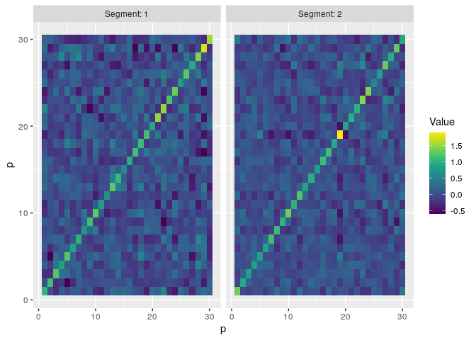

<!-- README.md is generated from README.Rmd. Please edit that file -->

# changepoint.cov

<!-- badges: start -->

[](https://github.com/grundy95/changepoint.cov/actions)
[](https://codecov.io/gh/grundy95/changepoint.cov)

<!-- badges: end -->

The goal of changepoint.cov is to provide methods for detecting
covariance or subspace changepoints in multivariate time series.

## Installation

<!-- You can install the released version of changepoint.cov from [CRAN](https://CRAN.R-project.org) with: -->
<!-- ``` r -->
<!-- install.packages("changepoint.cov") -->
<!-- ``` -->

You can install the development version from
[GitHub](https://github.com/) with:

``` r
# install.packages("devtools")
devtools::install_github("grundy95/changepoint.cov")
```

## Example

These basic examples show how to use the 2 main functions: `cptCov` for
detecting changes in covariance and `cptSubspace` for detecting changes
in subspace.

### `cptCov`

For detecting covariance changepoints in high-dimensional independent
time series, we recommend using `method='Ratio'`.

``` r
set.seed(1)
data <- wishartDataGeneration(n=200,p=30,tau=100)$data

ansRatio <- cptCov(X=data, method='Ratio')
summary(ansRatio)
#> Created using changepoint.cov version 0.5.0 
#> Method               :  Ratio 
#> Multiple changepoint method :  AMOC 
#> Minimum segment length      :  60 
#> Changepoints         :  96
plot(ansRatio)
```



For detecting covariance changes in low-dimensional, potentially
dependent time series we recommend using `method='CUSUM'`.

``` r
set.seed(1)

data <- wishartDataGeneration(n=200,p=3,tau=c(50,150))$data

ansCUSUM <- cptCov(X=data, method='CUSUM', numCpts='BinSeg', threshold='Manual', thresholdValue=7)
show(ansCUSUM)
#> Class, cptCovariance  : Covariance Changepoint x
#>            : S4 class containing  15  slots with names
#>                  subspaceDim nperm LRCov covEst subspaceEst version date method dataset cpts msl numCpts threshold thresholdValue cptsSig 
#> 
#> Created on      :  Tue Mar 30 15:08:42 2021 
#> 
#> Summary(.)      :
#> ---------------
#> Created using changepoint.cov version 0.5.0 
#> Method               :  CUSUM 
#> Multiple changepoint method :  BINSEG 
#> Minimum segment length      :  6 
#> Changepoints         :  59 151
cptsSig(ansCUSUM)
#>   cpts         T thresholdValue significant
#> 2   59 13.255543              7        TRUE
#> 3  151  7.618705              7        TRUE
#> 4   45  3.834405              7       FALSE
covEst(ansCUSUM)
#> [[1]]
#>            PC1        PC2        PC3
#> PC1  0.2411427  0.2113139 -0.1651886
#> PC2  0.2113139  1.3903415 -0.4141982
#> PC3 -0.1651886 -0.4141982  0.2836532
#> 
#> [[2]]
#>            PC1       PC2        PC3
#> PC1 0.74584049 0.1139156 0.04684264
#> PC2 0.11391557 0.8629125 0.37255546
#> PC3 0.04684264 0.3725555 1.13315173
#> 
#> [[3]]
#>             PC1         PC2         PC3
#> PC1  0.41821814 -0.03955294 -0.03716283
#> PC2 -0.03955294  0.46688293  0.01584048
#> PC3 -0.03716283  0.01584048  0.65631946
```

### `cptSubspace`

For detecting subspace changepoints in high-dimensional data using the
`cptSubspace` function.

``` r
set.seed(1)
data <- subspaceDataGeneration(n=100,p=20,subspaceDim=5,tau=50,changeSize=0.5*sqrt(5))$data
ansSubspace <- cptSubspace(X=data, subspaceDim=5, nperm=100)
summary(ansSubspace)
#> Created using changepoint.cov version 0.5.0 
#> Method               :  Subspace 
#> Multiple changepoint method :  AMOC 
#> Minimum segment length      :  20 
#> Changepoints         :  50
subspaceEst(ansSubspace)
#> [[1]]
#>               [,1]        [,2]        [,3]         [,4]        [,5]
#>  [1,] -0.306634945 -0.38061692  0.03005095  0.209841195 -0.21479599
#>  [2,] -0.023295229  0.04601747  0.11817483  0.114644462 -0.07736184
#>  [3,]  0.174299174 -0.25667090  0.03613504 -0.171354019 -0.26148231
#>  [4,]  0.133216989 -0.12438758 -0.35646986  0.147388756  0.51801321
#>  [5,] -0.109341525  0.30684585 -0.01431329  0.044041076 -0.27728919
#>  [6,] -0.171235562 -0.07505962 -0.01755111 -0.188008598 -0.01271848
#>  [7,]  0.304641803  0.36868876  0.01806936 -0.119612599 -0.04146972
#>  [8,]  0.096282782 -0.33368612 -0.45711018  0.037820635  0.07682975
#>  [9,] -0.038054730  0.05239461 -0.33548262 -0.001355701 -0.04867948
#> [10,] -0.000965908 -0.38624978  0.02810438  0.166202222 -0.29047239
#> [11,]  0.096625759  0.17251767  0.04881956  0.515146417 -0.17969347
#> [12,] -0.147989968  0.26260145 -0.31655962 -0.040649005 -0.28602655
#> [13,]  0.088885150 -0.08412251  0.01491905 -0.107928755 -0.38868098
#> [14,] -0.248334386  0.04343216  0.24013350 -0.527154576  0.12459279
#> [15,]  0.501940051  0.17939694 -0.29909892 -0.134633464 -0.14811028
#> [16,]  0.520126848 -0.25514769  0.22029173 -0.022657370 -0.03455092
#> [17,] -0.022536327  0.01966256  0.04634592 -0.082834253  0.27935349
#> [18,] -0.279784360  0.14631540 -0.27888880  0.212943674  0.01567108
#> [19,]  0.098898494  0.07234943  0.35944776  0.382147802  0.23890839
#> [20,]  0.025497953  0.20165072  0.16133608  0.194001310 -0.02368223
#> 
#> [[2]]
#>              [,1]         [,2]        [,3]        [,4]         [,5]
#>  [1,]  0.23912953  0.088054704  0.08715689 -0.33534499  0.244377967
#>  [2,]  0.07756817  0.137447707  0.33138435 -0.04647981 -0.148354192
#>  [3,] -0.04106168  0.297907213 -0.07919225 -0.50331402 -0.026211305
#>  [4,]  0.15661800 -0.574608455 -0.26878505  0.05044587  0.081807861
#>  [5,] -0.44921030  0.001585932  0.30644056  0.07864855 -0.103495912
#>  [6,] -0.02567239 -0.309374588  0.17300124 -0.26140297  0.092574265
#>  [7,] -0.18746445  0.085666476 -0.14026622  0.17889212 -0.450893221
#>  [8,]  0.12464379 -0.210618904 -0.35755113 -0.21960345 -0.282729694
#>  [9,] -0.26730980 -0.269036324 -0.11504467 -0.18415632 -0.101433459
#> [10,]  0.17319975  0.022771378 -0.11925605 -0.29763431 -0.205272244
#> [11,]  0.36429767  0.032102668  0.28596499 -0.11940202 -0.277630358
#> [12,] -0.32699784  0.041236572 -0.03228107 -0.31858449 -0.260024912
#> [13,]  0.11029588  0.057495681  0.02477713 -0.12357811 -0.161367972
#> [14,] -0.32035827  0.172551575 -0.23212165 -0.04820899  0.536474447
#> [15,] -0.26416783 -0.081507671 -0.12557837  0.18305050 -0.289118290
#> [16,]  0.18617261  0.246826832 -0.56018838  0.11173160 -0.046916255
#> [17,]  0.01169026 -0.112157618 -0.04248947  0.01490675  0.068938976
#> [18,] -0.04547149 -0.446837625  0.11093726 -0.17842696  0.074941772
#> [19,]  0.12257790 -0.131266954  0.15267950  0.28554157 -0.035231399
#> [20,]  0.28265671  0.035575076  0.03073275  0.24359038 -0.002572745
```

<!-- What is special about using `README.Rmd` instead of just `README.md`? You can include R chunks like so: -->
<!-- ```{r cars} -->
<!-- summary(cars) -->
<!-- ``` -->
<!-- You'll still need to render `README.Rmd` regularly, to keep `README.md` up-to-date. `devtools::build_readme()` is handy for this. You could also use GitHub Actions to re-render `README.Rmd` every time you push. An example workflow can be found here: <https://github.com/r-lib/actions/tree/master/examples>. -->
<!-- You can also embed plots, for example: -->
<!-- ```{r pressure, echo = FALSE} -->
<!-- plot(pressure) -->
<!-- ``` -->
<!-- In that case, don't forget to commit and push the resulting figure files, so they display on GitHub and CRAN. -->
